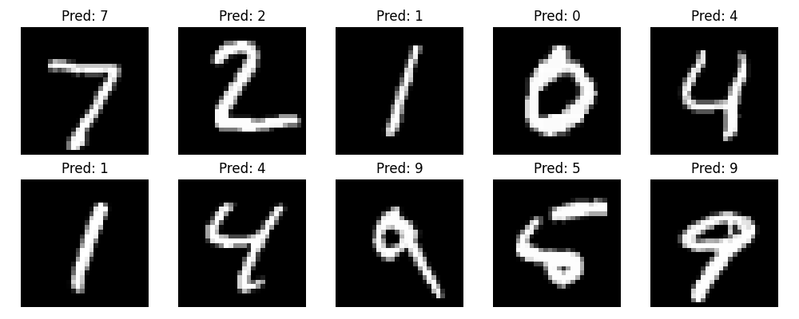

# MNIST Handwritten Digit Classifier

## 1. Which package/library does the sample program demonstrate?

This program demonstrates **PyTorch** (`torch`), along with `torchvision` for dataset loading and `matplotlib` for visualization.

---

## 2. How does someone run your program?

Install the required libraries:

```bash
pip install torch torchvision matplotlib
```

Then run:

```bash
python img_det.py
```

The MNIST dataset will be downloaded automatically on the first run.

---

## 3. What purpose does your program serve?

The program trains a neural network to recognize handwritten digits (0–9). This has real-world uses such as reading handwritten postal codes, processing bank cheques, and optical character recognition (OCR). It demonstrates a full machine learning pipeline: data loading, training, evaluation, and visualization.

---

## 4. What would be some sample input/output?

**Input:** 28×28 grayscale images of handwritten digits from the MNIST dataset.

**Console output:**

```
Training samples: 60000
Test samples: 10000

TRAINING...

Epoch 1 Accuracy: 90.21%
Epoch 2 Accuracy: 95.12%
Epoch 3 Accuracy: 96.58%
Epoch 4 Accuracy: 97.41%
Epoch 5 Accuracy: 97.96%

Test Accuracy: 97.45 %

Image 0: 7 | Confidence: 99.85%
Image 1: 2 | Confidence: 99.86%
Image 2: 1 | Confidence: 99.91%
Image 3: 0 | Confidence: 99.78%
Image 4: 4 | Confidence: 98.43%
Image 5: 1 | Confidence: 99.95%
Image 6: 4 | Confidence: 99.12%
Image 7: 9 | Confidence: 97.34%
Image 8: 5 | Confidence: 94.21%
Image 9: 9 | Confidence: 99.67%

Saved results to my_results.png
```

**Visual output:** The program saves `my_results.png` showing 10 handwritten digit images with their predicted labels.



---
